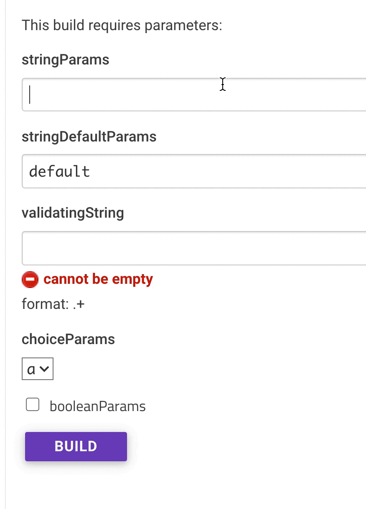
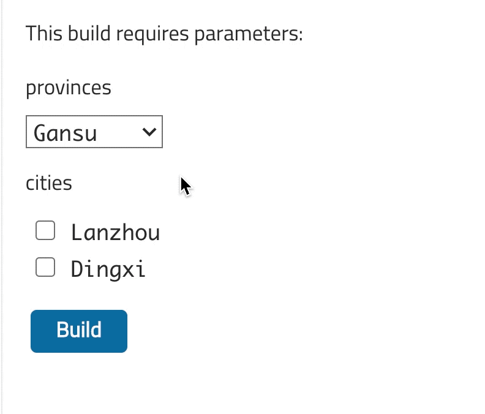

<!-- START doctoc generated TOC please keep comment here to allow auto update -->
<!-- DON'T EDIT THIS SECTION, INSTEAD RE-RUN doctoc TO UPDATE -->
**Table of Contents**  *generated with [DocToc](https://github.com/thlorenz/doctoc)*

- [parameters](#parameters)
- [active choice parameters](#active-choice-parameters)
- [mixed parameters](#mixed-parameters)

<!-- END doctoc generated TOC please keep comment here to allow auto update -->

### parameters
```groovy
properties([
  parameters([
    string(defaultValue: '', name: 'stringParams', description: '', trim: false),
    string(defaultValue: 'default', name: 'stringDefaultParams', description: '', trim: false),
    choice(choices: ['a', 'b', 'c', 'd'], name: 'choiceParams', description: ''),
    booleanParam(defaultValue: false, name: 'booleanParams', description: '')
  ])
])
```


### [active choice parameters](https://plugins.jenkins.io/uno-choice/)
```groovy
properties([
  parameters([
    [
      $class: 'ChoiceParameter',
      name: 'provinces',
      choiceType: 'PT_SINGLE_SELECT',
      description: '',
      script: [
        $class: 'GroovyScript',
        fallbackScript: [classpath: [], sandbox: false, script: '#!groovy return ["accept in ScriptApproval first"]'],
        script: [classpath: [],
                 sandbox: false,
                 script: '''return[
                  \'Gansu\',
                  \'Sichuan\',
                  \'Disabled:disabled\'
                ]'''
        ]
      ]
    ],
    [
      $class: 'CascadeChoiceParameter',
      name: 'cities',
      referencedParameters: 'provinces',
      choiceType: 'PT_CHECKBOX',
      description: '',
      script: [
        $class: 'GroovyScript',
        fallbackScript: [classpath: [], sandbox: false, script: '#!groovy return ["accept in ScriptApproval first"]'],
        script: [classpath: [],
                 sandbox: false,
                 script: '''if (provinces.equals("Gansu")) {
                    return ["Lanzhou", "Dingxi"]
                  } else if (provinces.equals("Sichuan")) {
                    return ["Leshan", "Guangyuan", "Chengdu:selected"]
                  } else if (provinces.equals("Disabled")) {
                    return ["notshow:selected"]
                  } else {
                    return ["Unknown scenarios"]
                  }'''
        ]
    ]]
  ])
])
```

- or
  ```groovy
  import groovy.transform.Field
  import org.jenkinsci.plugins.scriptsecurity.sandbox.groovy.SecureGroovyScript

  @Field def props = []
  @Field def newParams = []
  @Field def fb = new SecureGroovyScript("""return ['Script Error!']""", false)
  @Field def ps = new SecureGroovyScript("""return[ 'Gansu', 'Sichuan', 'Disabled:disabled' ]""", false )
  @Field def cs = new SecureGroovyScript("""#!groovy
    Map citySets = [
          Gansu : ['Lanzhou', 'Dingxi'] ,
        Sichuan : ['Leshan', 'Guangyuan', 'Chengdu:selected'] ,
       Disabled : ['notshow:selected']
    ]
    return citySets[provinces]
  """, false)

  newParams += [$class: 'ChoiceParameter',
                name: 'provinces',
                choiceType: 'PT_SINGLE_SELECT',
                script: [ $class: 'GroovyScript',
                          script: ps,
                          fallbackScript: fb
                ],
                description: ''
               ]
  newParams += [$class: 'CascadeChoiceParameter',
                name: 'cities',
                referencedParameters: 'provinces',
                choiceType: 'PT_CHECKBOX',
                script: [ $class: 'GroovyScript',
                          script: cs,
                          fallbackScript: fb
                ],
                description: ''
               ]
  props += [$class: 'ParametersDefinitionProperty', parameterDefinitions: newParams]
  properties(
    properties: props
  )
  ```


### mixed parameters
```groovy
import groovy.transform.Field
import org.jenkinsci.plugins.scriptsecurity.sandbox.groovy.SecureGroovyScript

@Field def props = []
@Field def newParams = []
@Field def fb = new SecureGroovyScript("""return ['Script Error!']""", false)
@Field def ps = new SecureGroovyScript("""return[ 'Gansu', 'Sichuan', 'Disabled:disabled' ]""", false )
@Field def cs = new SecureGroovyScript("""#!groovy
  Map citySets = [
        Gansu : ['Lanzhou', 'Dingxi'] ,
      Sichuan : ['Leshan', 'Guangyuan', 'Chengdu:selected'] ,
     Disabled : ['notshow:selected']
  ]
  return citySets[provinces]
""", false)

newParams += [$class: 'StringParameterDefinition' , name: 'lastName'  , defaultValue: 'Joe' , description: '']
newParams += [$class: 'StringParameterDefinition' , name: 'firstName' , defaultValue: 'Dan' , description: '']
newParams += [$class: 'ChoiceParameter',
              name: 'provinces',
              choiceType: 'PT_SINGLE_SELECT',
              script: [ $class: 'GroovyScript',
                        script: ps,
                        fallbackScript: fb
              ],
              description: ''
             ]
newParams += [$class: 'CascadeChoiceParameter',
              name: 'cities',
              referencedParameters: 'provinces',
              choiceType: 'PT_CHECKBOX',
              script: [ $class: 'GroovyScript',
                        script: cs,
                        fallbackScript: fb
              ],
              description: ''
             ]
newParams += [$class: 'BooleanParameterDefinition', name: 'notify', defaultValue: false, description: '']
props += [$class: 'ParametersDefinitionProperty', parameterDefinitions: newParams]
properties(
  properties: props
)

podTemplate(cloud: 'DevOps Kubernetes') {
  node(POD_LABEL) {
    stage('run') {
      println """
        lastName: ${params.lastName}
        firstName: ${params.firstName}
        provinces: ${params.provinces}
        cities: ${params.cities}
        notify: ${params.notify}
      """
    }
  }
}
```
