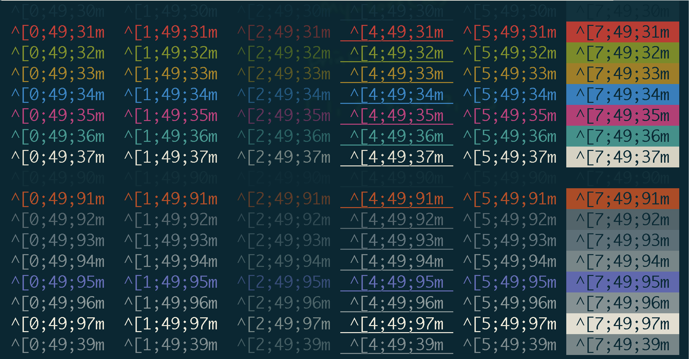
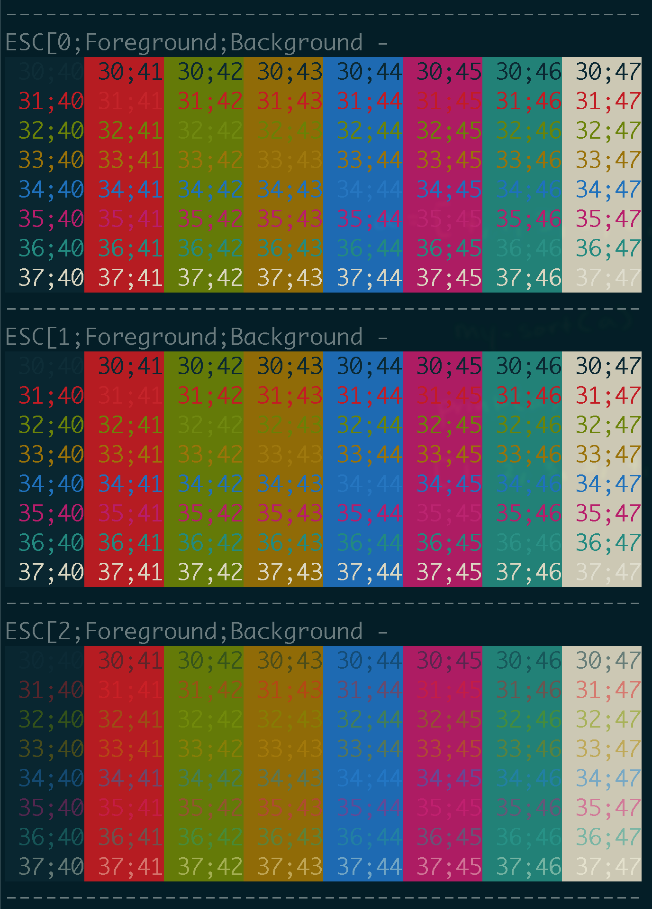

<!-- START doctoc generated TOC please keep comment here to allow auto update -->
<!-- DON'T EDIT THIS SECTION, INSTEAD RE-RUN doctoc TO UPDATE -->
**Table of Contents**  *generated with [DocToc](https://github.com/thlorenz/doctoc)*

- [scripts](#scripts)
  - [bash](#bash)

<!-- END doctoc generated TOC please keep comment here to allow auto update -->


> reference:
> - [Bash tips: Colors and formatting (ANSI/VT100 Control sequences)](https://misc.flogisoft.com/bash/tip_colors_and_formatting)
> - [Bash Colors](https://www.shellhacks.com/bash-colors/)
> - [color grid](http://www.quut.com/berlin/ht/cgrid.html)
> - [What color codes can I use in my PS1 prompt?](https://unix.stackexchange.com/a/124409/29178)

## scripts
### bash
- 256 colors
  ```bash
  function 256color() {
    for i in {0..255}; do
      echo -e "\e[38;05;${i}m█${i}";
    done | column -c 230 -s ' '; echo -e "\e[m"
  }
  ```
  

  ```bash
  #!/bin/bash

  # This program is free software. It comes without any warranty, to
  # the extent permitted by applicable law. You can redistribute it
  # and/or modify it under the terms of the Do What The Fuck You Want
  # To Public License, Version 2, as published by Sam Hocevar. See
  # http://sam.zoy.org/wtfpl/COPYING for more details.

  for fgbg in 38 48 ; do # Foreground / Background
      for color in {0..255} ; do # Colors
          # Display the color
          printf "\e[${fgbg};5;%sm  %3s  \e[0m" $color $color
          # Display 6 colors per lines
          if [ $((($color + 1) % 6)) == 4 ] ; then
              echo # New line
          fi
      done
      echo # New line
  done
  exit 0
  ```
  

- colors and formatting
  ```bash
  #!/bin/bash

  # This program is free software. It comes without any warranty, to
  # the extent permitted by applicable law. You can redistribute it
  # and/or modify it under the terms of the Do What The Fuck You Want
  # To Public License, Version 2, as published by Sam Hocevar. See
  # http://sam.zoy.org/wtfpl/COPYING for more details.

  #Background
  for clbg in {40..47} {100..107} 49 ; do
    #Foreground
    for clfg in {30..37} {90..97} 39 ; do
      #Formatting
      for attr in 0 1 2 4 5 7 ; do
        #Print the result
        echo -en "\e[${attr};${clbg};${clfg}m ^[${attr};${clbg};${clfg}m \e[0m"
      done
      echo #Newline
    done
  done
  exit 0
  ```
  

  ```bash
  for attr in 0 1 2 3 4 5 6 7; do
    echo "------------------------------------------------"
    printf "ESC[%s;Foreground;Background - \n" $attr
    for fore in 30 31 32 33 34 35 36 37; do
        for back in 40 41 42 43 44 45 46 47; do
            printf '\033[%s;%s;%sm %02s;%02s\033[0m' $attr $fore $back $fore $back
        done
    printf '\n'
    done
    printf '\033[0m'
  done
  ```
  

- solarized color
  ```bash
  #!/bin/bash

  # solarized ansicolors (exporting for grins)
  export base03='\033[0;30;40m'
  export base02='\033[1;30;40m'
  export base01='\033[0;32;40m'
  export base00='\033[0;33;40m'
  export base0='\033[0;34;40m'
  export base1='\033[0;36;40m'
  export base2='\033[0;37;40m'
  export base3='\033[1;37;40m'
  export yellow='\033[1;33;40m'
  export orange='\033[0;31;40m'
  export red='\033[1;31;40m'
  export magenta='\033[1;35;40m'
  export violet='\033[0;35;40m'
  export blue='\033[1;34;40m'
  export cyan='\033[1;36;40m'
  export green='\033[1;32;40m'
  export reset='\033[0m'

  colors () {
    echo -e "base03  ${base03}Test$reset"
    echo -e "base02  ${base02}Test$reset"
    echo -e "base01  ${base01}Test$reset"
    echo -e "base00  ${base00}Test$reset"
    echo -e "base0   ${base0}Test$reset"
    echo -e "base1   ${base1}Test$reset"
    echo -e "base2   ${base2}Test$reset"
    echo -e "base3   ${base3}Test$reset"
    echo -e "yellow  ${yellow}Test$reset"
    echo -e "orange  ${orange}Test$reset"
    echo -e "red     ${red}Test$reset"
    echo -e "magenta ${magenta}Test$reset"
    echo -e "violet  ${violet}Test$reset"
    echo -e "blue    ${blue}Test$reset"
    echo -e "cyan    ${cyan}Test$reset"
    echo -e "green   ${green}Test$reset"
  }
  colors
  ```
  
