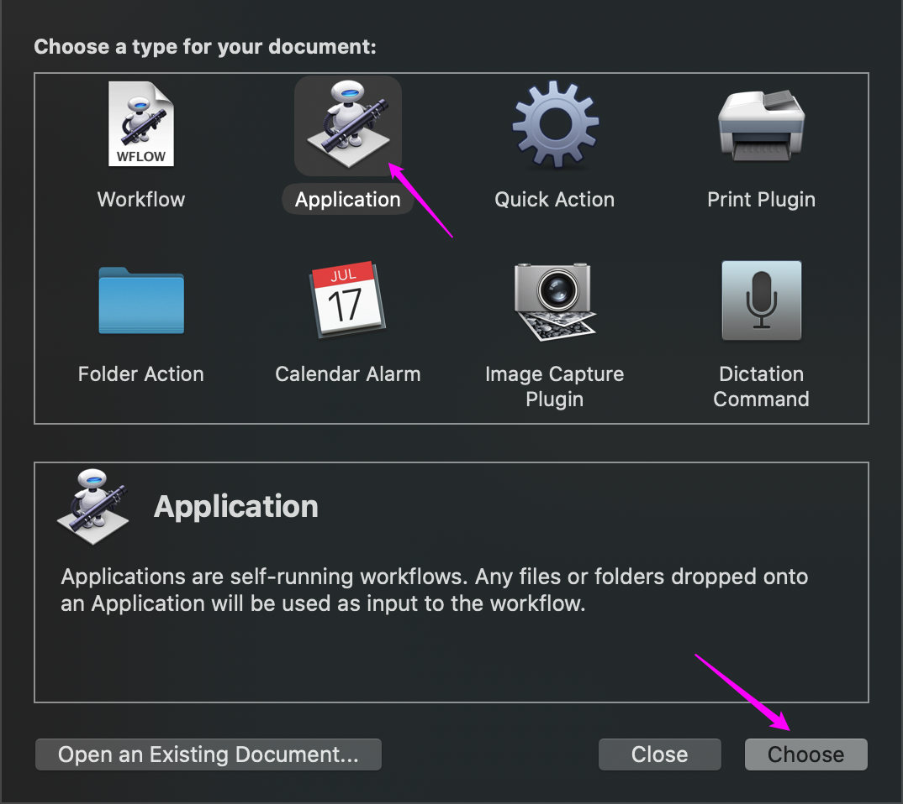
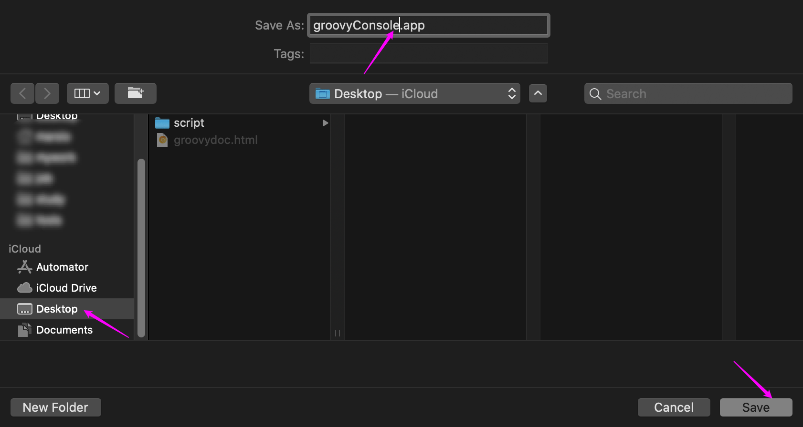
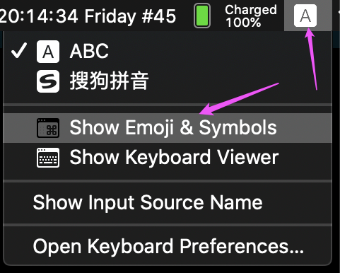
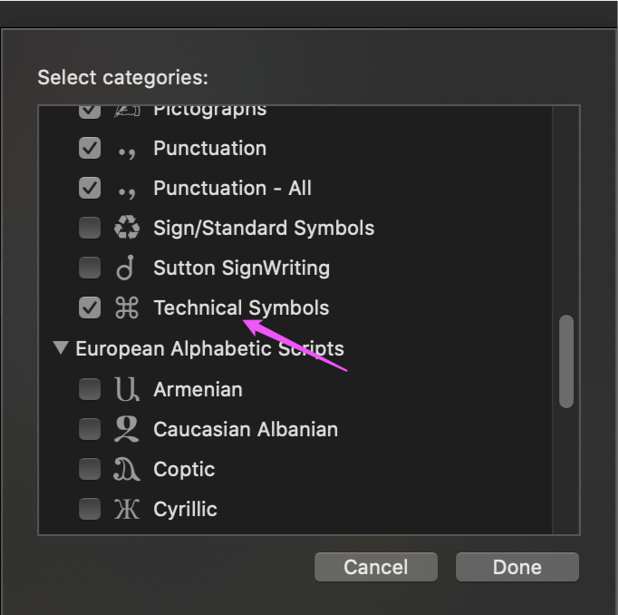
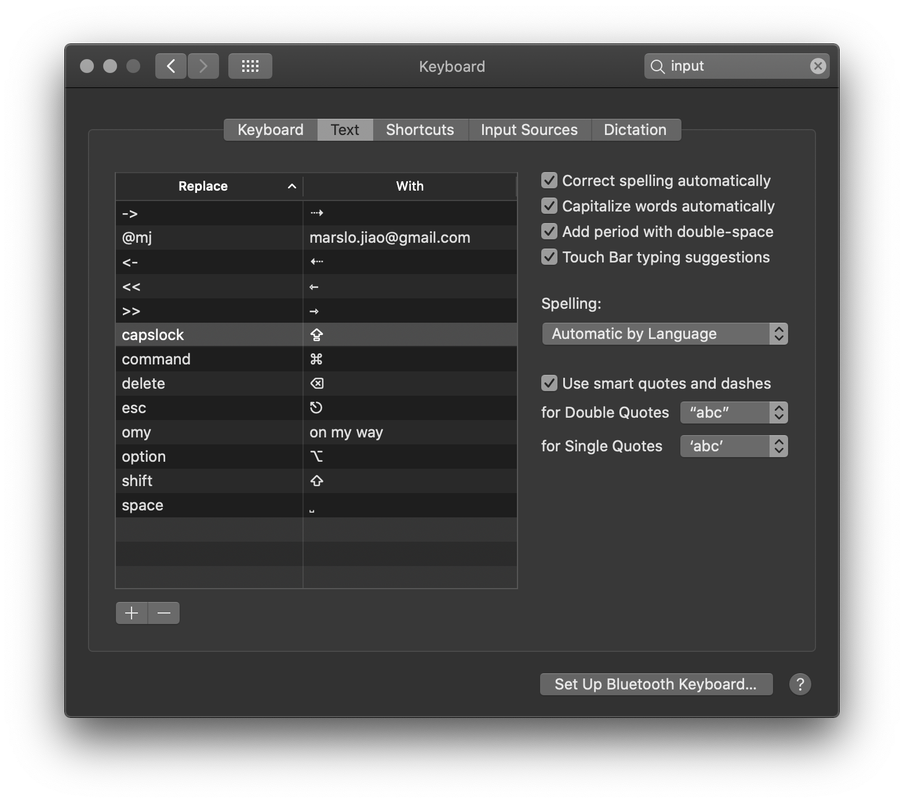

<!-- START doctoc generated TOC please keep comment here to allow auto update -->
<!-- DON'T EDIT THIS SECTION, INSTEAD RE-RUN doctoc TO UPDATE -->
**Table of Contents**  *generated with [DocToc](https://github.com/thlorenz/doctoc)*

- [copy path](#copy-path)
  - [copy STDOUT into clipboard](#copy-stdout-into-clipboard)
  - [Copy path from finder](#copy-path-from-finder)
- [create an app for script](#create-an-app-for-script)
  - [get standalone commands for the script](#get-standalone-commands-for-the-script)
  - [using Automator.app to create an app](#using-automatorapp-to-create-an-app)
  - [edit `Contents/Info.plist`](#edit-contentsinfoplist)
  - [create script to open the groovyConsole](#create-script-to-open-the-groovyconsole)
  - [set the icon for new app](#set-the-icon-for-new-app)
  - [move `groovyConsole.app` to `/Application`](#move-groovyconsoleapp-to-application)
- [add snippets for input](#add-snippets-for-input)
  - [enable Technical Symbols](#enable-technical-symbols)
  - [And snippets](#and-snippets)
  - [finally](#finally)
- [others](#others)
  - [launch apps](#launch-apps)
  - [create image](#create-image)
  - [disk](#disk)
  - [disable startup music](#disable-startup-music)
  - [3D lock screen](#3d-lock-screen)
  - [take screenshot after 3 sec](#take-screenshot-after-3-sec)
  - [setup welcome text in login screen](#setup-welcome-text-in-login-screen)
  - [show message on desktop](#show-message-on-desktop)
  - [modify font in plist](#modify-font-in-plist)
  - [show process details](#show-process-details)

<!-- END doctoc generated TOC please keep comment here to allow auto update -->


## copy path
### copy STDOUT into clipboard

> [!NOTE]
> - `pbcopy` for macOS
> - `xclip` for Linux

```bash
$ <cmd> | pbcopy
```

- example
  ```bash
  $ cat file | pbcopy
  $ pwd | pbcopy
  ```

### Copy path from finder
- [*right-click*(<kbd>control</kbd> + left-click) -> <kbd>option</kbd>](https://osxdaily.com/2013/06/19/copy-file-folder-path-mac-os-x/)


- Automator -> Quick Action


- [Automator -> Apple Script](https://apple.stackexchange.com/a/47234/254265)

  ```bash
  on run {input, parameters}

    try
      tell application "Finder" to set the clipboard to POSIX path of (target of window 1 as alias)
    on error
      beep
    end try

    return input
  end run
  ```


## create an app for script
> case: run `groovyConsole` from Spolite or Alfred
> reference: [Install groovy console on Mac and make it runnable from dock](https://superuser.com/a/1303372/112396)

### get standalone commands for the script
```bash
$ ps aux | grep groovyConsole | grep -v grep
marslo           50495   0.0  3.4 11683536 577828   ??  S     5:50PM   0:15.85 /Library/Java/JavaVirtualMachines/jdk1.8.0_211.jdk/Contents/Home/bin/java -Xdock:name=GroovyConsole -Xdock:icon=/usr/local/opt/groovy/libexec/lib/groovy.icns -Dgroovy.jaxb=jaxb -classpath /usr/local/opt/groovy/libexec/lib/groovy-3.0.6.jar -Dscript.name=/usr/local/opt/groovy/libexec/bin/groovyConsole -Dprogram.name=groovyConsole -Dgroovy.starter.conf=/usr/local/opt/groovy/libexec/conf/groovy-starter.conf -Dgroovy.home=/usr/local/opt/groovy/libexec -Dtools.jar=/Library/Java/JavaVirtualMachines/jdk1.8.0_211.jdk/Contents/Home/lib/tools.jar org.codehaus.groovy.tools.GroovyStarter --main groovy.console.ui.Console --conf /usr/local/opt/groovy/libexec/conf/groovy-starter.conf --classpath .:/Library/Java/JavaVirtualMachines/jdk1.8.0_211.jdk/Contents/Home/lib/tools.jar:/Library/Java/JavaVirtualMachines/jdk1.8.0_211.jdk/Contents/Home/lib/dt.jar:/usr/local/opt/groovy/libexec/lib:.
```
==> which would be:
```bash
/Library/Java/JavaVirtualMachines/jdk1.8.0_211.jdk/Contents/Home/bin/java \
        -Xdock:name=GroovyConsole \
        -Xdock:icon=/usr/local/opt/groovy/libexec/lib/groovy.icns \
        -Dgroovy.jaxb=jaxb \
        -classpath /usr/local/opt/groovy/libexec/lib/groovy-3.0.6.jar \
        -Dscript.name=/usr/local/opt/groovy/libexec/bin/groovyConsole \
        -Dprogram.name=groovyConsole \
        -Dgroovy.starter.conf=/usr/local/opt/groovy/libexec/conf/groovy-starter.conf \
        -Dgroovy.home=/usr/local/opt/groovy/libexec \
        -Dtools.jar=/Library/Java/JavaVirtualMachines/jdk1.8.0_211.jdk/Contents/Home/lib/tools.jar org.codehaus.groovy.tools.GroovyStarter \
        --main groovy.console.ui.Console \
        --conf /usr/local/opt/groovy/libexec/conf/groovy-starter.conf \
        --classpath .:/Library/Java/JavaVirtualMachines/jdk1.8.0_211.jdk/Contents/Home/lib/tools.jar:/Library/Java/JavaVirtualMachines/jdk1.8.0_211.jdk/Contents/Home/lib/dt.jar:/usr/local/opt/groovy/libexec/lib:.
```

### using Automator.app to create an app
- Open **Automator.app** » **New** » **Application**
  
- Select **Run Shell Script** » save to <name>.app with empty shell script
  

  

### edit `Contents/Info.plist`
```bash
$ vim groovyConsole.app/Contents/Info.plist
...
<key>CFBundleExecutable</key>
<string>gConsole</string>           « the script name, can be any name you want
<key>CFBundleIconFile</key>
<string>groovy</string>
<key>CFBundleIdentifier</key>
<string>com.apple.groovyConsole</string>
...
```

- original
  ```bash
  <key>CFBundleExecutable</key>
  <string>Application Stub</string>
  <key>CFBundleIconFile</key>
  <string>AutomatorApplet</string>
  <key>CFBundleIdentifier</key>
  <string>com.apple.automator.groovyConsole</string>
  ```

### create script to open the groovyConsole
```bash
$ touch groovyConsole.app/Contents/MacOS/groovyConsole

$ cat > groovyConsole.app/Contents/MacOS/groovyConsole << EOF
  -> #!/bin/bash
  -> /Library/Java/JavaVirtualMachines/jdk1.8.0_211.jdk/Contents/Home/bin/java \\
  ->         -Xdock:name=GroovyConsole \\
  ->         -Xdock:icon=/usr/local/opt/groovy/libexec/lib/groovy.icns \\
  ->         -Dgroovy.jaxb=jaxb \\
  ->         -classpath /usr/local/opt/groovy/libexec/lib/groovy-3.0.6.jar \\
  ->         -Dscript.name=/usr/local/opt/groovy/libexec/bin/groovyConsole \\
  ->         -Dprogram.name=groovyConsole \\
  ->         -Dgroovy.starter.conf=/usr/local/opt/groovy/libexec/conf/groovy-starter.conf \\
  ->         -Dgroovy.home=/usr/local/opt/groovy/libexec \\
  ->         -Dtools.jar=/Library/Java/JavaVirtualMachines/jdk1.8.0_211.jdk/Contents/Home/lib/tools.jar org.codehaus.groovy.tools.GroovyStarter \\
  ->         --main groovy.console.ui.Console \\
  ->         --conf /usr/local/opt/groovy/libexec/conf/groovy-starter.conf \\
  ->         --classpath .:/Library/Java/JavaVirtualMachines/jdk1.8.0_211.jdk/Contents/Home/lib/tools.jar:/Library/Java/JavaVirtualMachines/jdk1.8.0_211.jdk/Contents/Home/lib/dt.jar:/usr/local/opt/groovy/libexec/lib:.
  -> EOF

$ chmod +x groovyConsole.app/Contents/MacOS/groovyConsole
```
- try validate via execute `groovyConsole.app/Contents/MacOS/groovyConsole` directly. to see whether if the groovyConsole will be opened.
  

### set the icon for new app
> optional

```bash
$ cp /usr/local/opt/groovy/libexec/lib/groovy.icns groovyConsole.app/Contents/Resources
```
- or
  ```bash
  $ ln -sf /usr/local/opt/groovy/libexec/lib/groovy.icns groovyConsole.app/Contents/Resources/groovy.icns
  ```

### move `groovyConsole.app` to `/Application`
```bash
$ mv groovyConsole.app/ /Applications/
```

## [add snippets for input](https://sspai.com/post/36203)
### enable Technical Symbols
- Input Method ⇢ **Show emoji and symbols**
  

- Open **Customized List** ⇢ **Technical Symbols**
  

  

### And snippets
- go to **System Preferences** ⇢ **Keyboard** ⇢ **Test**
- Add snippets as below
  

### finally


## others
### launch apps
```bash
$ launchctl list
```

### create image
- create dmg image
  ```bash
  $ hdiutil create -volname "Volume Name" -srcfolder /path/to/folder -ov diskimage.dmg
  ```
- create encrypted image
  ```bash
  $ hdiutil create -encryption -stdinpass -volname "Volume Name" -srcfolder /path/to/folder -ov encrypted.dmg
  ```
- creaste dvd (for .iso, .img, .dmg)
  ```bash
  $ hdiutil burn /path/to/image_file
  ```

### disk
- check volumn info
  ```bash
  $ diskutil info <path/to/volumn>
  ```
  - i.e.:
    ```bash
    $ diskutil info /Volumes/iMarsloOSX/
       Device Identifier:         disk1s5
       Device Node:               /dev/disk1s5
       Whole:                     No
       Part of Whole:             disk1

       Volume Name:               iMarsloOSX
       Mounted:                   Yes
       Mount Point:               /
    ```

- list disks and volumns
  ```bash
  $ diskutil list
  ```

  - or [lsblk](https://command-not-found.com/lsblk)
    ```bash
    $ docker run cmd.cat/lsblk lsblk
    NAME   MAJ:MIN RM SIZE RO TYPE MOUNTPOINT
    vda    254:0    0  16G  0 disk
    └─vda1 254:1    0  16G  0 part /etc/hosts
    ```

  - or [lshw](https://command-not-found.com/lshw)
    ```bash
    $ docker run cmd.cat/lshw lshw -class disk
      *-virtio1
           description: Virtual I/O device
           physical id: 0
           bus info: virtio@1
           logical name: vda
           configuration: driver=virtio_blk
    ```

- list the apfs info
  ```bash
  $ diskutil apfs list
  APFS Container (1 found)
  |
  +-- Container disk1 ********-****-****-****-************
      ====================================================
      APFS Container Reference:     disk1
      Size (Capacity Ceiling):      250685575168 B (250.7 GB)
      Capacity In Use By Volumes:   176258826240 B (176.3 GB) (70.3% used)
      Capacity Not Allocated:       74426748928 B (74.4 GB) (29.7% free)
      |
      +-< Physical Store...>
      |
      +-> ...
  ```

- check detail diskage usage
  ```bash
  $ sudo fs_usage
  21:03:47  ioctl        0.000003   iTerm2
  21:03:47  ioctl        0.000003   iTerm2
  21:03:47  close        0.000031   privoxy
  21:03:47  select       0.000004   privoxy
  ...
  ```

#### [check usb](https://apple.stackexchange.com/a/170118/254265)
```bash
$ system_profiler SPUSBDataType
```
- or get xml format
  ```bash
  $ system_profiler -xml SPUSBDataType
  ```
- or
  ```bash
  $ ioreg -p IOUSB
  ```
- or
  ```bash
  $ ioreg -p IOUSB -w0 -l
  ```
  - or get device name
    ```bash
     $ ioreg -p IOUSB -w0 | sed 's/[^o]*o //; s/@.*$//' | grep -v '^Root.*'
    ```

### disable startup music
```bash
$ sudo nvram SystemAudioVolume=" "
```

### 3D lock screen
```bash
$ /System/Library/CoreServices/Menu\ Extras/User.menu/Contents/Resources/CGSession -suspend
```

### take screenshot after 3 sec
```bash
$ screencapture -T 3 -t jpg -P delayedpic.jpg
```

### setup welcome text in login screen
```bash
$ sudo defaults write /Library/Preferences/com.apple.loginwindow LoginwindowText 'Awesome Marslo!!'
```

### show message on desktop
```bash
$ sudo jamf displayMessage -message "Hello World!"
```

### modify font in plist
- original
  ```bash
  $ defaults read ~/Library/Preferences/groovy.console.ui.plist
  {
      "/groovy/console/ui/" =     {
          autoClearOutput = true;
          compilerPhase = 4;
          currentFileChooserDir = "/Users/marslo/Desktop";
          decompiledFontSize = 12;
          fontSize = 18;
          frameHeight = 600;
          frameWidth = 800;
          frameX = 198;
          frameY = 201;
          horizontalSplitterLocation = 100;
          inputAreaHeight = 576;
          inputAreaWidth = 1622;
          outputAreaHeight = 354;
          outputAreaWidth = 1676;
          showClosureClasses = false;
          showIndyBytecode = false;
          showScriptClass = true;
          showScriptFreeForm = false;
          showScriptInOutput = false;
          showTreeView = true;
          threadInterrupt = true;
          verticalSplitterLocation = 100;
      };
  }
  ```

  - [or](https://stackoverflow.com/a/56238780/2940319)
    ```bash
    $ /usr/libexec/PlistBuddy -c 'print ":/groovy/console/ui/:fontSize"' ~/Library/Preferences/groovy.console.ui.plist
    18
    ```
- change
  ```bash
  $ /usr/libexec/PlistBuddy -c 'Set ":/groovy/console/ui/:fontSize" 24' ~/Library/Preferences/groovy.console.ui.plist
  $ /usr/libexec/PlistBuddy -c 'Print ":/groovy/console/ui/:fontSize"' ~/Library/Preferences/groovy.console.ui.plist
  24
  ```

### show process details

