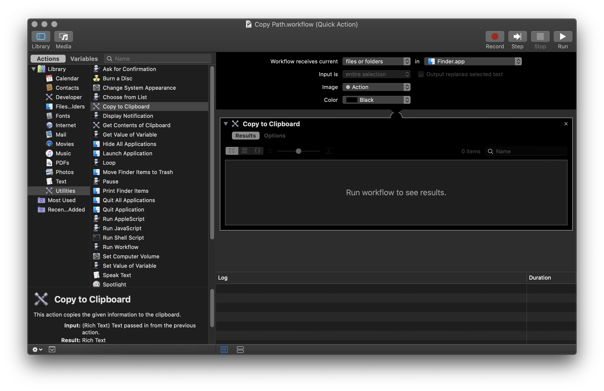

<!-- START doctoc generated TOC please keep comment here to allow auto update -->
<!-- DON'T EDIT THIS SECTION, INSTEAD RE-RUN doctoc TO UPDATE -->
**Table of Contents**  *generated with [DocToc](https://github.com/thlorenz/doctoc)*

- [copy STDOUT into clipboard](#copy-stdout-into-clipboard)
- [Copy path from finder](#copy-path-from-finder)
- [create an app for script](#create-an-app-for-script)

<!-- END doctoc generated TOC please keep comment here to allow auto update -->


### copy STDOUT into clipboard

> [!NOTE]
> - `pbcopy` for macOS
> - `xclip` for Linux

```bash
$ <cmd> | pbcopy
```

- example
  ```bash
  $ cat file | pbcopy
  $ pwd | pbcopy
  ```

### Copy path from finder
- [*right-click*(<kbd>control</kbd> + left-click) -> <kbd>option</kbd>](https://osxdaily.com/2013/06/19/copy-file-folder-path-mac-os-x/)


- Automator -> Quick Action




- [Automator -> Apple Script](https://apple.stackexchange.com/a/47234/254265)

  ```bash
  on run {input, parameters}

    try
      tell application "Finder" to set the clipboard to POSIX path of (target of window 1 as alias)
    on error
      beep
    end try

    return input
  end run
  ```


### create an app for script
> case: run `groovyConsole` from Spolite or Alfred
> reference: [Install groovy console on Mac and make it runnable from dock](https://superuser.com/a/1303372/112396)

#### get standalone commands for the script
```bash
$ ps aux | grep groovyConsole | grep -v grep
marslo           50495   0.0  3.4 11683536 577828   ??  S     5:50PM   0:15.85 /Library/Java/JavaVirtualMachines/jdk1.8.0_211.jdk/Contents/Home/bin/java -Xdock:name=GroovyConsole -Xdock:icon=/usr/local/opt/groovy/libexec/lib/groovy.icns -Dgroovy.jaxb=jaxb -classpath /usr/local/opt/groovy/libexec/lib/groovy-3.0.6.jar -Dscript.name=/usr/local/opt/groovy/libexec/bin/groovyConsole -Dprogram.name=groovyConsole -Dgroovy.starter.conf=/usr/local/opt/groovy/libexec/conf/groovy-starter.conf -Dgroovy.home=/usr/local/opt/groovy/libexec -Dtools.jar=/Library/Java/JavaVirtualMachines/jdk1.8.0_211.jdk/Contents/Home/lib/tools.jar org.codehaus.groovy.tools.GroovyStarter --main groovy.console.ui.Console --conf /usr/local/opt/groovy/libexec/conf/groovy-starter.conf --classpath .:/Library/Java/JavaVirtualMachines/jdk1.8.0_211.jdk/Contents/Home/lib/tools.jar:/Library/Java/JavaVirtualMachines/jdk1.8.0_211.jdk/Contents/Home/lib/dt.jar:/usr/local/opt/groovy/libexec/lib:.
```
==> which would be:
```bash
/Library/Java/JavaVirtualMachines/jdk1.8.0_211.jdk/Contents/Home/bin/java \
        -Xdock:name=GroovyConsole \
        -Xdock:icon=/usr/local/opt/groovy/libexec/lib/groovy.icns \
        -Dgroovy.jaxb=jaxb \
        -classpath /usr/local/opt/groovy/libexec/lib/groovy-3.0.6.jar \
        -Dscript.name=/usr/local/opt/groovy/libexec/bin/groovyConsole \
        -Dprogram.name=groovyConsole \
        -Dgroovy.starter.conf=/usr/local/opt/groovy/libexec/conf/groovy-starter.conf \
        -Dgroovy.home=/usr/local/opt/groovy/libexec \
        -Dtools.jar=/Library/Java/JavaVirtualMachines/jdk1.8.0_211.jdk/Contents/Home/lib/tools.jar org.codehaus.groovy.tools.GroovyStarter \
        --main groovy.console.ui.Console \
        --conf /usr/local/opt/groovy/libexec/conf/groovy-starter.conf \
        --classpath .:/Library/Java/JavaVirtualMachines/jdk1.8.0_211.jdk/Contents/Home/lib/tools.jar:/Library/Java/JavaVirtualMachines/jdk1.8.0_211.jdk/Contents/Home/lib/dt.jar:/usr/local/opt/groovy/libexec/lib:.
```

#### using Automator.app to create an app
- Open **Automator.app** » **New** » **Application**
  
- Select **Run Shell Script** » save to <name>.app with empty shell script
  

  

#### edit `Contents/Info.plist`
```bash
$ vim groovyConsole.app/Contents/Info.plist
...
<key>CFBundleExecutable</key>
<string>gConsole</string>           « the script name, can be any name you want
<key>CFBundleIconFile</key>
<string>groovy</string>
<key>CFBundleIdentifier</key>
<string>com.apple.groovyConsole</string>
...
```

- original
  ```bash
  <key>CFBundleExecutable</key>
  <string>Application Stub</string>
  <key>CFBundleIconFile</key>
  <string>AutomatorApplet</string>
  <key>CFBundleIdentifier</key>
  <string>com.apple.automator.groovyConsole</string>
  ```

#### create script to open the groovyConsole
```bash
$ touch groovyConsole.app/Contents/MacOS/groovyConsole

$ cat > groovyConsole.app/Contents/MacOS/groovyConsole << EOF
  -> #!/bin/bash
  -> /Library/Java/JavaVirtualMachines/jdk1.8.0_211.jdk/Contents/Home/bin/java \\
  ->         -Xdock:name=GroovyConsole \\
  ->         -Xdock:icon=/usr/local/opt/groovy/libexec/lib/groovy.icns \\
  ->         -Dgroovy.jaxb=jaxb \\
  ->         -classpath /usr/local/opt/groovy/libexec/lib/groovy-3.0.6.jar \\
  ->         -Dscript.name=/usr/local/opt/groovy/libexec/bin/groovyConsole \\
  ->         -Dprogram.name=groovyConsole \\
  ->         -Dgroovy.starter.conf=/usr/local/opt/groovy/libexec/conf/groovy-starter.conf \\
  ->         -Dgroovy.home=/usr/local/opt/groovy/libexec \\
  ->         -Dtools.jar=/Library/Java/JavaVirtualMachines/jdk1.8.0_211.jdk/Contents/Home/lib/tools.jar org.codehaus.groovy.tools.GroovyStarter \\
  ->         --main groovy.console.ui.Console \\
  ->         --conf /usr/local/opt/groovy/libexec/conf/groovy-starter.conf \\
  ->         --classpath .:/Library/Java/JavaVirtualMachines/jdk1.8.0_211.jdk/Contents/Home/lib/tools.jar:/Library/Java/JavaVirtualMachines/jdk1.8.0_211.jdk/Contents/Home/lib/dt.jar:/usr/local/opt/groovy/libexec/lib:.
  -> EOF

$ chmod +x groovyConsole.app/Contents/MacOS/groovyConsole
```

- try validate via execute `groovyConsole.app/Contents/MacOS/groovyConsole` directly. to see whether if the groovyConsole will be opened.

#### set the icon for new app
> optional

```bash
$ cp /usr/local/opt/groovy/libexec/lib/groovy.icns groovyConsole.app/Contents/Resources
```
- or
  ```bash
  $ ln -sf /usr/local/opt/groovy/libexec/lib/groovy.icns groovyConsole.app/Contents/Resources/groovy.icns
  ```

#### move `groovyConsole.app` to `/Application`
```bash
$ mv groovyConsole.app/ /Applications/
```


