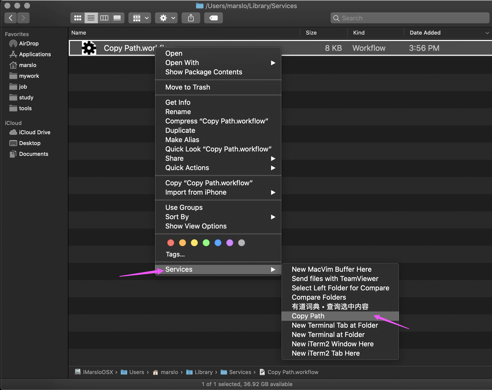

<!-- START doctoc generated TOC please keep comment here to allow auto update -->
<!-- DON'T EDIT THIS SECTION, INSTEAD RE-RUN doctoc TO UPDATE -->
**Table of Contents**  *generated with [DocToc](https://github.com/thlorenz/doctoc)*

- [copy STDOUT into clipboard](#copy-stdout-into-clipboard)
- [Copy path from finder](#copy-path-from-finder)

<!-- END doctoc generated TOC please keep comment here to allow auto update -->


### copy STDOUT into clipboard

> [!NOTE]
> - `pbcopy` for macOS
> - `xclip` for Linux

```bash
$ <cmd> | pbcopy
```

- example
  ```bash
  $ cat file | pbcopy
  $ pwd | pbcopy
  ```

### Copy path from finder
- [*right-click*(<kbd>control</kbd> + left-click) -> <kbd>option</kbd>](https://osxdaily.com/2013/06/19/copy-file-folder-path-mac-os-x/)


- Automator -> Quick Action




- [Automator -> Apple Script](https://apple.stackexchange.com/a/47234/254265)

  ```bash
  on run {input, parameters}

    try
      tell application "Finder" to set the clipboard to POSIX path of (target of window 1 as alias)
    on error
      beep
    end try

    return input
  end run
  ```


